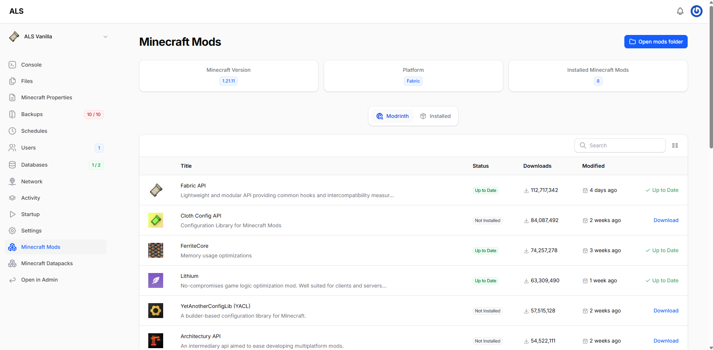
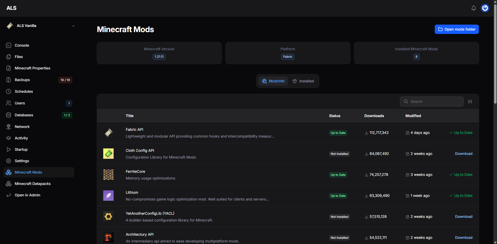
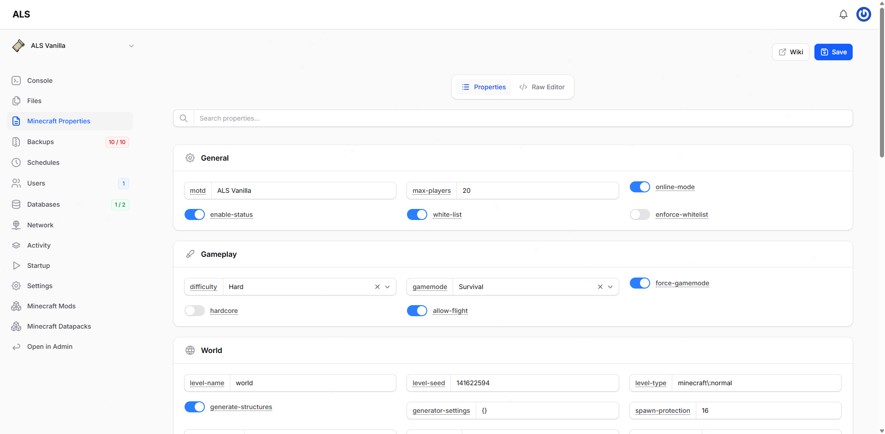
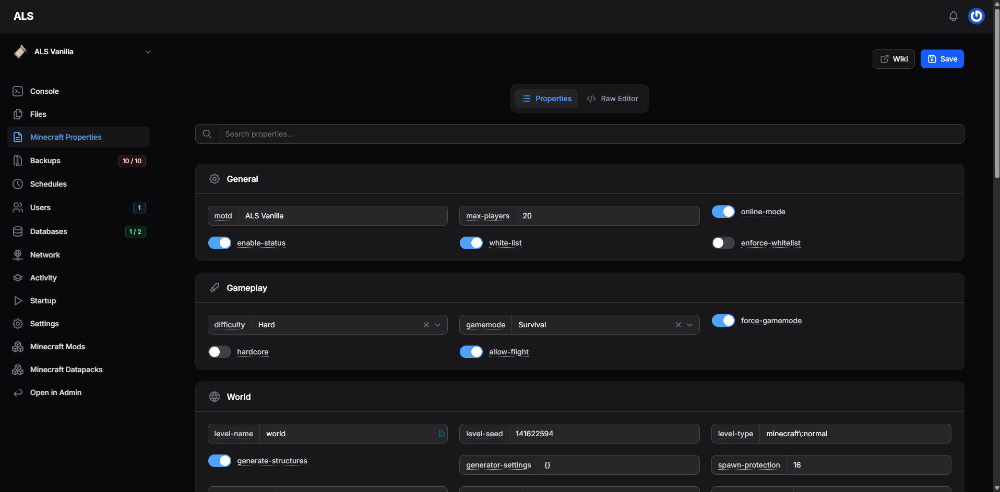
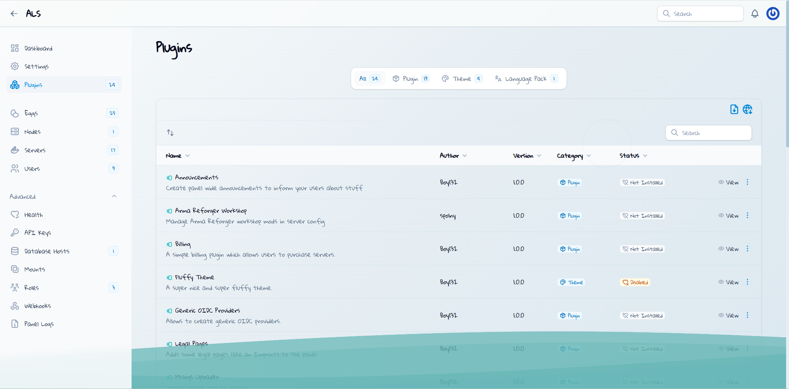
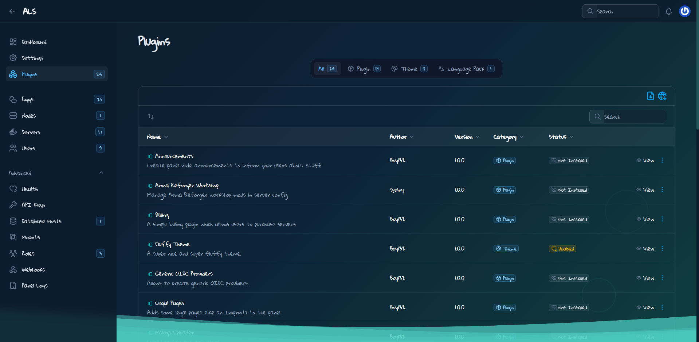
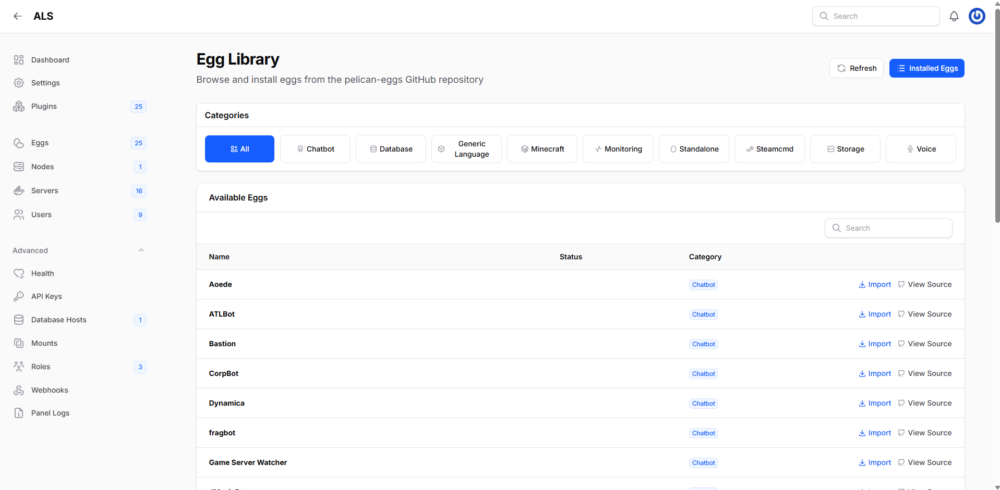
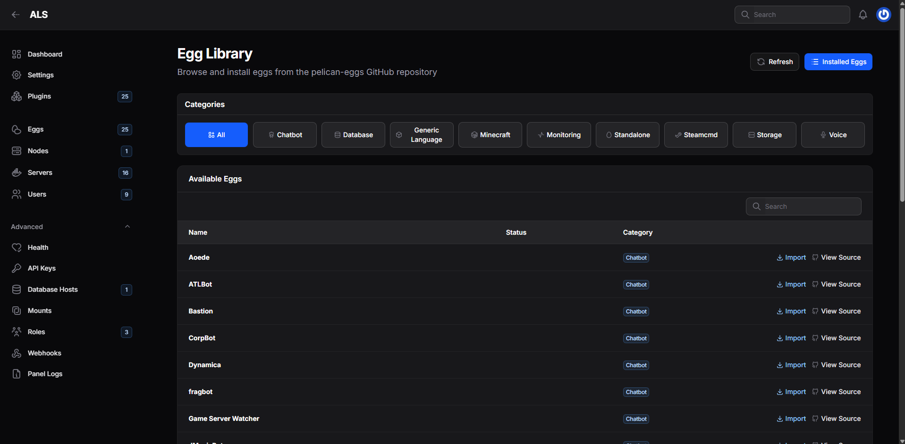

# Pelican Panel Plugins

This repository contains plugins for [Pelican Panel](https://github.com/pelican-dev/panel).

More plugins will be added over time.

## Available Plugins

### [Minecraft Modrinth](minecraft-modrinth/)

Manage mods, plugins and datapacks via Modrinth.

Based on the original version by [Boy132](https://github.com/pelican-dev/plugins/tree/main/minecraft-modrinth).

 

### [Minecraft Properties](minecraft-properties/)

Manage Minecraft server properties.

Based on the original version by [Fritz](https://github.com/pelican-plugins-community/minecraft-properties).

 

### [Pelican Waters](pelican-waters/)

A calm, elegant theme for Pelican Panel inspired by serene lake waters. Features animated waves, water ripples, and glass-morphism effects.

 

### [Egg Library](egg-library/)

Browse and install eggs directly from the pelican-eggs GitHub organization.

 
